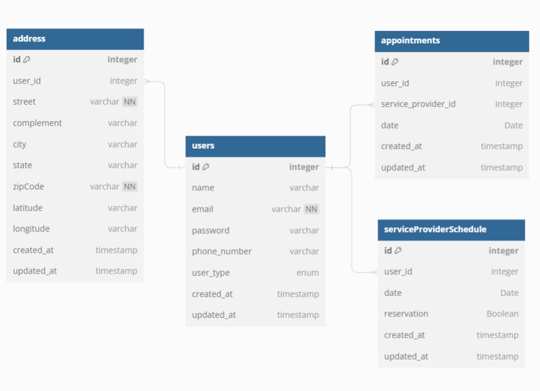

# Health System Front-end
The initial idea is to create a backend where the user can schedule a consultation with a doctor.  
Maybe in the future add some features like videocall for online medical consultation.  
The frontend will be done in Nuxt/Vue, you can follow the <a href="https://github.com/MatheusFelizardo/health-system-frontend"> frontend here </a>  
The main goal of this project is to practice Java and its architecture.

## Data model

 
You have three possibilities of users: Patient, Doctor, and Company.  
For now, the password is not required because there's no login system yet. But the idea in the future is allow the possibility to have a dashboard for the doctors/company.  
Every user will have an address associated. After the first register, when the user tries to make another appointment, the user address info will be pre-loaded from the backend info, using the e-mail (unique).
